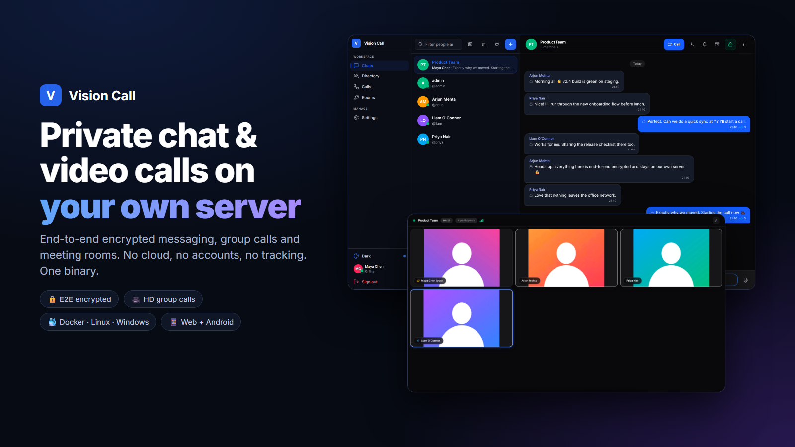
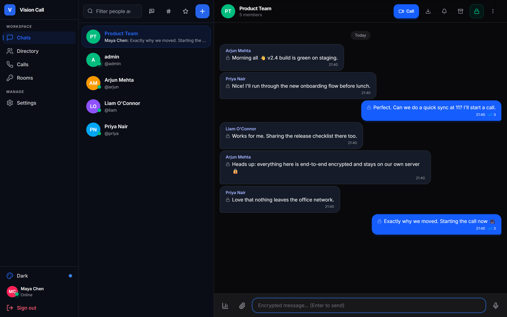
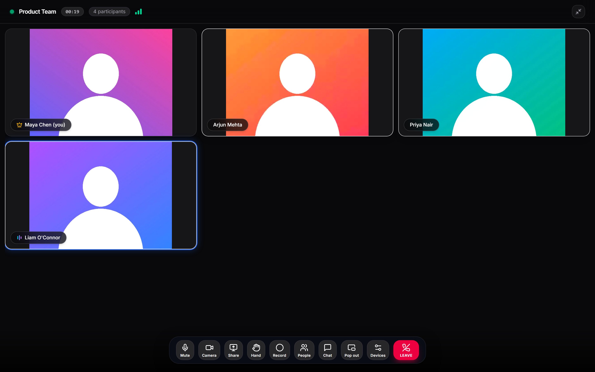
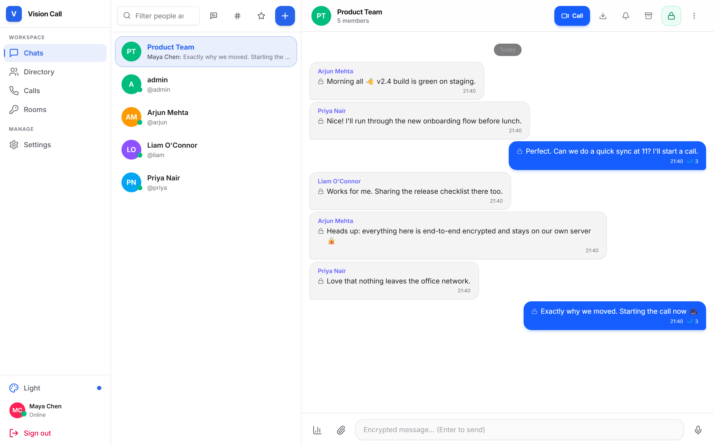
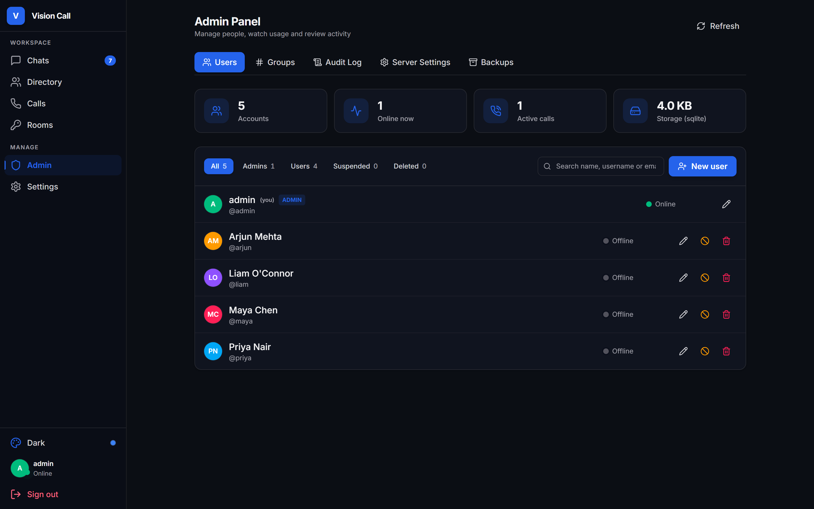

# Vision Call

<p align="center"></p>

[](https://github.com/anand34577/vision-call/releases/latest)
[](https://github.com/anand34577/vision-call/actions/workflows/ci.yml)
[](LICENSE)

Private chat and video calling that runs on your own computer or server. Your messages, calls and files stay on your network, with no cloud service in the middle.

Install it once on a machine in your office or home. Everyone on the same network or VPN then uses it from a browser or the Android app.

**[Read the wiki](https://github.com/anand34577/vision-call/wiki)** for full setup guides, configuration and troubleshooting.

## Features

- **Chat**: one-to-one and group conversations with read receipts, typing indicators, replies, reactions, edits, pins, saved messages, search and file sharing. End-to-end encrypted over HTTPS.
- **Video calls**: one-to-one calls straight between devices, group calls for up to 8 people by default, screen sharing, and host controls.
- **Meeting rooms**: named rooms with an optional passcode or approval step.
- **Presence**: online, away and Do Not Disturb.
- **Admin tools**: manage accounts, change settings in the browser, read the audit log, and optionally use single sign-on (OpenID Connect).
- **Runs anywhere**: Docker, Linux, Windows or macOS, on regular PCs and ARM boards like the Raspberry Pi. Uses a built-in database by default, or Postgres/MySQL if you prefer.
- **Any device**: modern browsers on computers and phones (installable as an app), plus a native Android app.

## Screenshots

| Chat | Group call |
|---|---|
|  |  |

| Light theme | Admin panel |
|---|---|
|  |  |

Six built-in themes, including Dark, Light, Midnight OLED and Nordic Forest. People and conversations shown are demo data.

## Install

Pick one. None of them need any configuration.

### Docker

```bash
docker run -d --name visioncall --restart unless-stopped \
  -p 8443:8443 -p 8080:8080 -p 7882:7882/udp \
  -v visioncall-data:/data \
  ghcr.io/anand34577/vision-call:latest
```

Or with Docker Compose:

```bash
curl -fsSL https://raw.githubusercontent.com/anand34577/vision-call/main/docker-compose.yml -o docker-compose.yml
docker compose up -d
```

Get the first admin password with `docker logs visioncall 2>&1 | grep -i password`. More in [Install with Docker](https://github.com/anand34577/vision-call/wiki/Install-with-Docker).

### Linux

```bash
curl -fsSL https://raw.githubusercontent.com/anand34577/vision-call/main/scripts/get.sh | sudo sh
```

Installs a system service that starts on boot, takes a daily backup and prints the address and admin password. More in [Install on Linux](https://github.com/anand34577/vision-call/wiki/Install-on-Linux).

### Windows

In PowerShell run as Administrator:

```powershell
irm https://raw.githubusercontent.com/anand34577/vision-call/main/scripts/get.ps1 | iex
```

Installs a Windows service that starts with Windows and prints the address and admin password. More in [Install on Windows](https://github.com/anand34577/vision-call/wiki/Install-on-Windows).

### macOS, Android and manual downloads

Every [release](https://github.com/anand34577/vision-call/releases/latest) has ready-to-run downloads for Linux, Windows and macOS (Apple Silicon), and a signed Android APK. See [Install on macOS](https://github.com/anand34577/vision-call/wiki/Install-on-macOS) and [Android App](https://github.com/anand34577/vision-call/wiki/Android-App).

## Open it

1. On any device on your network, open `https://<server-ip>:8443`.
2. The browser warns about the certificate, because the server made its own. Choose **Advanced** and continue, or [install the certificate](https://github.com/anand34577/vision-call/wiki/HTTPS-and-Certificates) to remove the warning.
3. Sign in as `admin` with the password from the install output, change it, then create accounts for your team under **Admin > Users**.

The Android app connects to `http://<server-ip>:8080`.

Firewall ports: **8443/tcp** (HTTPS), **8080/tcp** (HTTP and Android), **7882/udp** (group-call media). The installers open them for you.

## Documentation

| | |
|---|---|
| [Quick Start](https://github.com/anand34577/vision-call/wiki/Quick-Start) | Up and running in five minutes |
| [First Steps](https://github.com/anand34577/vision-call/wiki/First-Steps) | Sign in, add people, first call |
| [HTTPS and Certificates](https://github.com/anand34577/vision-call/wiki/HTTPS-and-Certificates) | Remove the browser warning, use your own certificate or a reverse proxy |
| [Networking and Firewall](https://github.com/anand34577/vision-call/wiki/Networking-and-Firewall) | Ports, VPNs and the optional TURN relay |
| [Configuration](https://github.com/anand34577/vision-call/wiki/Configuration) | Every setting explained |
| [Backups and Upgrades](https://github.com/anand34577/vision-call/wiki/Backups-and-Upgrades) | Keep your data safe and stay up to date |
| [Troubleshooting](https://github.com/anand34577/vision-call/wiki/Troubleshooting) | Fixes for common problems |
| [Security](https://github.com/anand34577/vision-call/wiki/Security) | How accounts, messages and calls are protected |
| [Building from Source](https://github.com/anand34577/vision-call/wiki/Building-from-Source) | Develop and build it yourself |

## How it works

Vision Call is a single Go program with the web app built in. It serves the app, its API and a WebSocket connection for chat and call signaling. One-to-one calls go directly between the two devices with WebRTC. Group calls run through a built-in media server based on [pion/webrtc](https://github.com/pion/webrtc), which forwards encrypted audio and video without storing it. Data is kept in SQLite by default.

## Contributing

Issues and pull requests are welcome. See [Building from Source](https://github.com/anand34577/vision-call/wiki/Building-from-Source) to get a development setup running. Please report security problems privately through [security advisories](https://github.com/anand34577/vision-call/security/advisories/new).

## License

[MIT](LICENSE)
